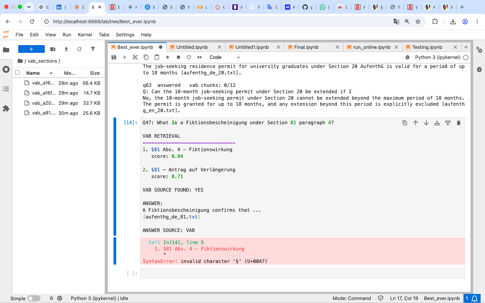

# Berlin bureaucracy RAG

Answers questions about German registration and residence law for international
students in Berlin. It reads German statutes and Berlin administrative pages,
answers in English, cites the section it used, and says so when its sources do
not cover the question.

**Not legal advice.** Check the cited section before acting.



---

## Results

100 realistic student questions, graded by hand against the source text.

| | |
|---|---|
| correct | 76 |
| wrong | 2 |
| stale source | 1 |
| partial | 1 |
| declined | 20 |

The stale source case is separated from the errors on purpose. The system
reported a figure as the 2025 rate because `visum_studium.md` says *aktueller
Wert für das Jahr 2025*. The answer was faithful to its source; the source is out
of date. That is a corpus problem, not a retrieval or generation one.

The 20 declined questions are mostly intentional. Tax identification numbers,
bank accounts, the Rundfunkbeitrag and pension contributions are deliberately
absent from the corpus, so questions about them should be declined. Keeping some
questions permanently unanswerable is what makes refusal measurable, without
them there is no way to tell whether the system is declining sensibly or has
simply stopped trying.

Correctness is not scored automatically. The harness reports retrieval and
refusal behaviour; every answer was read and checked against the text it cited.

---

## Corpus

| folder | contents |
|---|---|
| `bmg_sections/` | Bundesmeldegesetz, 13 sections, German and English |
| `aufenthg_sections/` | Aufenthaltsgesetz, 6 sections, German and English |
| `sgb_sections/` | SGB V, 7 sections, student health insurance |
| `aufenthv_sections/` | Aufenthaltsverordnung, 6 sections, visa procedure and fees |
| `vab_sections/` | Berlin LEA guidance (VAB), 4 sections |
| `*.md` | Berlin service portal, LEA pages, the health ministry, one insurer |

68 documents, 614 chunks of roughly 750 characters.

Four topics are covered: address registration, the student residence permit,
working rights during study, and health insurance. The corpus is strong on legal
obligations and thin on administrative procedure, the law says what you must do,
not how to get a Bürgeramt appointment or what a Krankenkasse charges. That
boundary comes from the sources themselves, and it keeps the system away from the
information most likely to go out of date.

---

## How it works

```
question
  ├─ embed (text-embedding-3-small) ─────────────── semantic score
  └─ rewrite into German legal keywords (LLM) ──┐
     original question ─────────────────────────┴─ BM25 score
                                                   (60% original, 40% rewritten)

     weighted fusion: 70% semantic, 30% BM25, min-max normalised
     top 12 chunks, at most 2 per source
     → generation, with citation and refusal instructions
```


---

## Known limitations

The same question can be answered in German and declined in English within a
single run. The German rewrite narrows this gap in retrieval but does not close
it in generation.

The recurring generation failure is applying a rule to a situation next to, but
outside, the category the source names, student jobs versus any activity a
student happens to do, SGB V §5 versus §10, §27 versus §29.

Source freshness is a correctness property. The system reports whatever year its
source states, so a page scraped in 2026 that still quotes a 2025 figure produces
a confidently cited stale answer. Amounts and thresholds change annually and need
re-downloading.

At n = 100 the margin is roughly ±9 points. Differences smaller than that are not
meaningful, and several questions flip between correct and wrong under small
prompt changes.

---

## Running it

```bash
git clone https://github.com/HassanHijaze/berlin-rag.git
cd berlin-rag
pip install -r requirements.txt

echo "OPENAI_API_KEY=sk-proj-..." > API.env
```

```bash
uvicorn api:app --reload --port 8000     # the interface, at 127.0.0.1:8000
python rag.py ask "How long do I have to register?"
python rag.py                            # run the evaluation set
python rag.py check "..."                # same question three times, checks reproducibility
pytest                                   # offline tests
pytest -m live                           # the tests that call the API
```

Embeddings are cached in `Documents/vectors_614.npy`, so the first run does not
re-embed. Delete the cache after changing the corpus.

---

## Evaluation

`Documents/100.json` holds the 100 questions behind the results above. They cover
all four topics in the phrasing students actually use, including questions the
corpus cannot answer.

---

## Layout

```
rag.py              corpus, retrieval, generation, evaluation harness
api.py              FastAPI service and the web interface
test_rag.py         chunking, citation parsing, API validation
pytest.ini          marks the tests that cost money as `live`
Documents/          the corpus, the evaluation set, the cached embeddings
```

The documents in `Documents/` are reproduced from public German government,
Berlin state and insurer sources for evaluation purposes, and remain the property
of their publishers.
